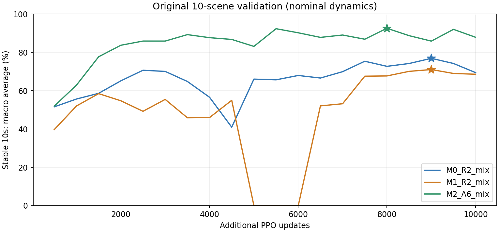

# M系列完成评估：2026-09-24

三组formal_20260923_v2均有completed.json，iteration=9999。M0/M1从FT_R2初始化；M2从A6初始化。评估了每组最终checkpoint和按原10场景验证宏平均预选的checkpoint，共6×52=312个新20s CPU trial。复用上一轮R2/A6/M2@2500的配对结果，未触碰480例留出集。

结论：M2在原混合场景中的覆盖最全面，最终点较2500减少过渡移动，但新梯架场景有退化；M1最终点在新杂物集合有竞争力，值得保留为R2直接适配的短流程对照。不能把“原验证最优”“最新”“新形状泛化最好”混成同一结论。

## 训练验证与checkpoint选择

原验证集每次320个trial，10类场景，nominal动力学。预选规则是在每组已有checkpoint中最大化10类场景等权平均的连续站稳10s比例，不按新杂物表现选择。等权宏平均与按320个trial加权的总体比例不同。

|组|父代|最终9999宏平均|预选更新点|预选宏平均|
|---|---|---:|---:|---:|
|M0_R2_mix|R2|69.42%|9000|76.90%|
|M1_R2_mix|R2|68.59%|9000|71.04%|
|M2_A6_mix|A6|87.87%|8000|92.58%|

曲线原样保留，无平滑。M1在5000–6000的严格站稳指标均为0，6500恢复；对应日志仍有运动路程和负载，未见NaN/OOM报错。这里不能仅凭该指标认定完全无法起身，也未额外重跑这几个中间checkpoint。

最终9999各场景连续站稳10s：

|原训练验证场景（n）|M0|M1|M2|
|---|---:|---:|---:|
|平地（80）|100.0%|100.0%|100.0%|
|自由板（64）|51.6%|84.4%|82.8%|
|导向板（48）|75.0%|60.4%|87.5%|
|固定顶板（16）|100.0%|81.2%|100.0%|
|四腿桌（16）|62.5%|81.2%|75.0%|
|金字塔台阶（20）|90.0%|75.0%|95.0%|
|箱体地形（28）|46.4%|53.6%|82.1%|
|L形自由箱（16）|87.5%|68.8%|100.0%|
|双板（16）|31.2%|62.5%|93.8%|
|箱板混合（16）|50.0%|18.8%|62.5%|

M2相对A6的关键提升：固定顶板43.8%→100%，四腿桌25%→75%，双板50%→93.8%，箱板混合18.8%→62.5%。但table在M2@9500为93.8%、9999为75%，不能说后期单调改善。原GPU验证的成功判据和场景库与下面CPU新形状诊断不同，不跨表直接比较百分点。

## 新杂物开发集

48个相同冻结初态，每类12个、四方向均衡；另有4个移除障碍物的平地校准。所有6个新模型的平地校准Q/E均4/4，没有数值失败。checkpoint原生actor与归一化加载严格匹配，原生推理/导出封装一致。93D、50Hz/500Hz、PD及启动限幅与上一轮协议一致，脚本验证协议和几何索引SHA一致。

每格为 **Q / E**：Q=连续安静站立10s；E=同时通过实际碰撞分件的竖直上移探针。探针可能因挂在手臂上的物体而不通过，不能把E未通过统称“起不来”。阈值沿用[首轮协议](clutter_eval_v1_zh.md)，未根据此次结果修改。

|场景（各12例）|A6@9999|M2@2500|M0@9999|M1@9999|M2@8000|M2@9999|
|---|---:|---:|---:|---:|---:|---:|
|交叉木条|12 / 11|12 / 8|12 / 11|11 / 11|12 / 11|12 / 12|
|梯架＋板|11 / 9|12 / 12|12 / 11|12 / 12|8 / 7|10 / 8|
|固定C空间|4 / 4|11 / 11|8 / 8|10 / 10|11 / 11|11 / 11|
|空心容器|8 / 7|8 / 8|6 / 6|8 / 7|9 / 9|9 / 8|
|合计（48例）|35 / 31|43 / 39|38 / 36|41 / 40|40 / 38|42 / 39|

额外预选模型：M0@9000为39/37，M1@9000为40/33（Q/E）；均未全面超过各自最终模型。因此原训练验证排名不能直接作为新物体泛化排名。

视频确认M2后期有梯架挂在胸前、颈肩和下肢附近的例子：M2@8000梯架仅8/12通过Q、7/12通过E；M2@9999改善为10/12和8/12，但仍低于2500的12/12。交叉木条的E则从8/12升至12/12。这是场景间的取舍，不能只汇总总成功率。

## 负载、移动与接触有效性

峰值P95：先对每个trial的29关节、全20s取绝对峰值，再在48个trial之间取95分位，包含失败；力矩/速度按2ms保存，功率是单关节abs(tau×dq)，不是整机电功率。

|指标|A6@9999|M2@2500|M0@9999|M1@9999|M2@8000|M2@9999|
|---|---:|---:|---:|---:|---:|---:|
|力矩峰值P95 / Nm|139.00|132.04|128.81|139.00|137.74|139.00|
|速度峰值P95 / rad/s|18.07|17.20|16.22|19.27|13.81|15.55|
|功率峰值P95 / W|1005.63|820.47|797.44|916.33|932.50|903.19|
|累计>90%力矩上限时长P95 / s|12.00|1.46|6.75|6.31|1.20|3.04|

M2@9999相对2500的关节速度尾部下降，但功率P95从820W升至903W，持续高负载时长也从1.46s升至3.04s；因此不能称整体更安全。所有模型在模型力矩限幅下运行；nominal仿真未包含实际电流、热保护或真实负载误差。

配对移动（只比较两策略都达到对应事件的同一批案例，不给未脱困例记0）：

|比较|共同clear例数|首次clear之后路程 / m|同批最大锚点位移 / m|
|---|---:|---|---|
|M2_2500 -> M2_9999|34|0.918 → 0.476|0.654 → 0.258|
|M0_9999 -> M1_9999|36|0.568 → 0.659|0.308 → 0.501|
|M1_9999 -> M2_9999|34|0.679 → 0.482|0.516 → 0.262|

M2早期到最终的过渡路程约减半；但首次Q保持1s后的配对路程从0.052m升到0.090m（40例），仍有改善最终安静程度的空间。M0→M1的外移门控改动没有在这轮单seed中保证更短路程，不能从奖励名称直接推断行为。

对所有9模型的468条保存轨迹补做50Hz外部接触检查：M0/M1最终没有采样到>20mm穿透；M2@9999有一个空箱案例，在1.5s时左手/箱壁穿透20.43mm。M2@8000有2例，A6有2例，M0@9000有1例；每例仅一个保存帧超过20mm。M2梯架挂住案例未采样到>20mm穿透，不能用这项解释全部挂住，但50Hz审计不排除两帧之间的更深接触或穿透。

额外敏感性统计把有>20mm采样穿透的整条trial算失败，保持48的分母：M0最终Q/E仍38/36，M1仍41/40，M2最终变41/38（原42/39）；A6变33/29。原协议分数未改写，次级筛查单独留档。正式安全验证需500Hz接触监测及机器人动力学压力测试。

本次安静站立1s后未观察到再倒地；这不覆盖起身前的挣扎、卡住或持续大力。

## 建议

1. M2@9999作为覆盖多种原有受限场景的下一轮主候选；M1@9999作为R2直接适配的短流程对照。新杂物集合中M1的E为40/48，M2为39/48，不能宣称M2在这里显著领先。
2. 保留M2@2500做新形状泛化参照，不用最终checkpoint覆盖它。M2@8000保留为按原验证预选的模型，而不是唯一“最好”模型。
3. 暂不因增加训练步数而直接追加20k；优先诊断梯架/多杆残留接触和被套住之后的策略停滞，并做质量、增益、延迟的独立压力测试。下一轮若把这些新物体纳入训练，另建训练初态，不直接复用开发/留出案例。
4. 当前数据支持“已有压板训练经历有助原混合任务适配”，不证明A6阶段必不可少：M1/M2训练经历和总预算不同且只有单seed。短流程与完整流程应保留配对、多seed或预算匹配对照。

## 视频与证据

最终三组视频：列M0/M1/M2@9999；四行仰卧、伏卧、左侧、右侧；固定layout1/variant0、20s原速，不按成功挑姿态。

- [交叉木条：三组最终模型](/home/luyd/workspace/smp-a6-egress/outputs/clutter_eval_final_20260924/videos_final/crossed_timber_paired_20s.mp4)
- [梯架：三组最终模型](/home/luyd/workspace/smp-a6-egress/outputs/clutter_eval_final_20260924/videos_final/ladder_boards_paired_20s.mp4)
- [固定C空间：三组最终模型](/home/luyd/workspace/smp-a6-egress/outputs/clutter_eval_final_20260924/videos_final/fixed_c_space_paired_20s.mp4)
- [空箱：三组最终模型](/home/luyd/workspace/smp-a6-egress/outputs/clutter_eval_final_20260924/videos_final/hollow_container_paired_20s.mp4)

M2训练进展视频：列2500/8000/9999，相同初态：
- [梯架：重点看挂住与完全摆脱的差别](/home/luyd/workspace/smp-a6-egress/outputs/clutter_eval_final_20260924/videos_m2_progress/ladder_boards_paired_20s.mp4)
- [空箱：后期接触处理](/home/luyd/workspace/smp-a6-egress/outputs/clutter_eval_final_20260924/videos_m2_progress/hollow_container_paired_20s.mp4)

完整输出：`outputs/clutter_eval_final_20260924`。checkpoint SHA/原生actor一致性见[运行协议](evidence/clutter_final_20260924/rollout_protocol.json)；[汇总与逐例配对差异](evidence/clutter_final_20260924/comparison.json)、[接触审计](evidence/clutter_final_20260924/contact_audit.json)、[穿透敏感性](evidence/clutter_final_20260924/penetration_sensitivity.json)。本次没有改变训练、部署配置或论文正式数字。

复现沿用`evaluate_clutter.py`和`review_clutter_metrics.py`，聚合入口新增`summarize_clutter_final.py`；`audit_clutter_trace_contacts.py`读取已保存状态，不重新运行策略。所有输出均为开发验证；留出480例仍冻结。
